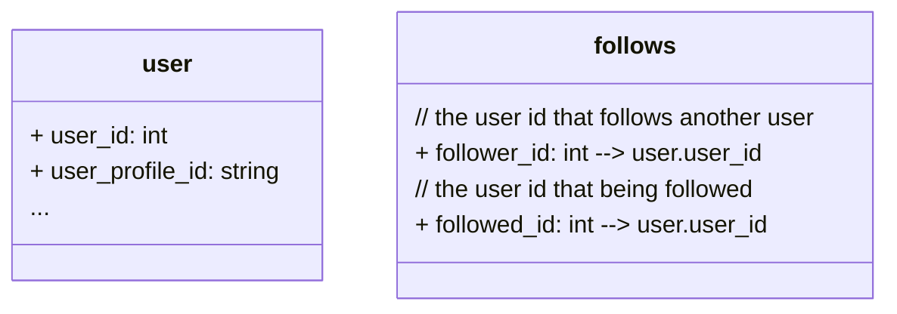

# Follower system design

The basic requirements are as follows:

Design a system that could handle the following features

- Follow/unfollow another user
- Return and paginate these lists:
  - Following users
  - Followers users
  - Friends users (both following and being followed)

The design should also considered high traffic scenario.

## Assumptions

I'll assume the existing system already have the basic user system, and the schema will be similar to the following chart

| User_id | user_profile_id | ... |
|---------|------|-----|
| system generated id | user defined id | ....|

The above user id should be the identifier for the internal system, while the user profile id will be the identifier user used to retrieve other user profile.

## Basic design

Here is a glimps of how the system handles the user interaction

For query interactions:

For follow/unfollow interactions:

Data base design

